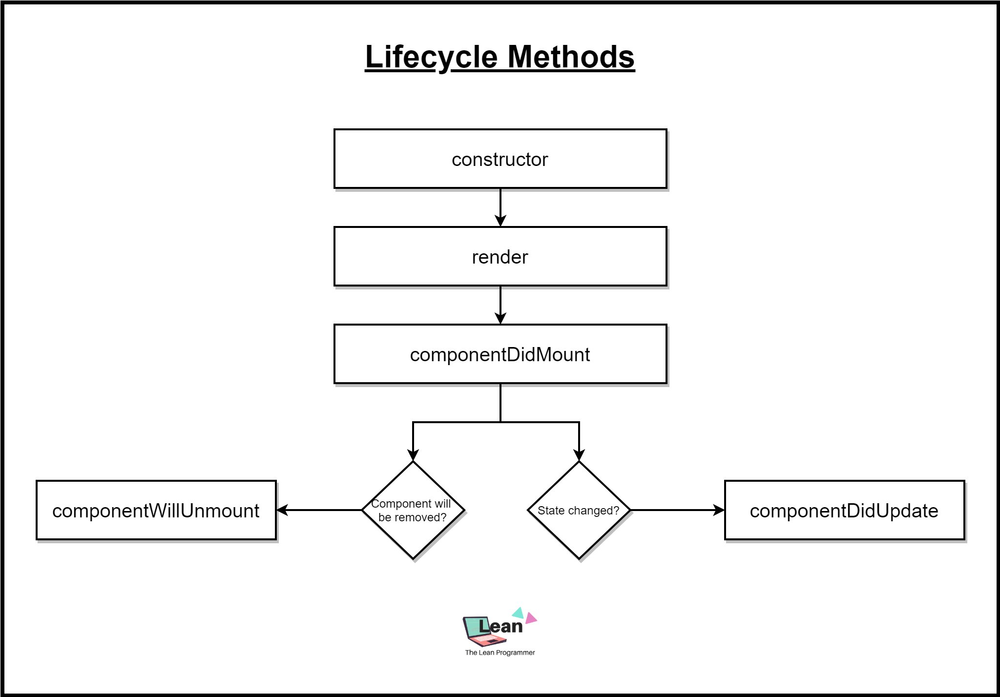
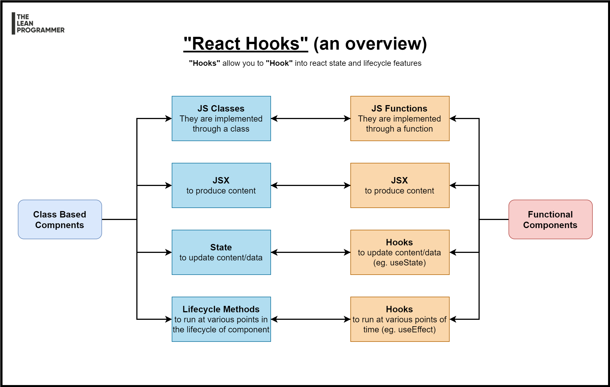

# React Starter Workshop

Content for React Workshop for Cyborg club at NITR. 

Check out my full React Tutorial

1. [Project #1: Understanding the Basics](https://www.youtube.com/playlist?list=PLGyA74h_S9NqJvvQ7-l9bUHHS6bMCkgo0)
2. [Project #2: Revisiting the Basics](https://www.youtube.com/playlist?list=PLGyA74h_S9NppHNrzUSjMQbnuHS9jlAcY)
3. [Project #3: Understanding Flexbox - Coming soon...](https://www.youtube.com/TheLeanProgrammer?sub_confirmation=1)

## Set up a new CRA

1. `npx create-react-app playground`
2. `cd playground`
3. `npm start`

## Things to discuss during webinar

1. Why React?
2. React Components
3. Sample Component Architechture
4. One Way Data Flow In React
5. JSX
6. State
7. Props
8. Lifecycle Methods
9. React Hooks
10. lifecycle methods vs useEffect

## Why React?

1. Fast Learning Curve
2. Reusable components
3. Fast Render with Virtual DOM
4. Great Dev Tools
5. Great Dev Community
6. Proper Modularization
7. Clean Abstraction
8. React Native, React Desktop

## React Components


## React Sample Component Architecture for Pokedex App

See the app in action here: [http://madhavbahl.tech/react-pokedex](http://madhavbahl.tech/react-pokedex)


## React Component Hierarchy and One Way Data Flow


## Sample Application

Let's build a counter app!

## React Lifecycle Methods



## React Hooks



## useState hook

Let's you use state in functional components

```ts
const [ state, setState ] = useState<StateSchema>(initialState)
```

## useEffect hook

Similar to lifecycle methods, but different :D

```js
useEffect(() => {
  // Method you wish to run
}, [dependencyArray]);
```

## useEffect dependency array

Different cases of dependency array

1. [] - Empty array

Runs at the initial render only!

```js
useEffect(() => {
  console.log ("This will run at initial render of the component only")
}, []);
```

2. Array with some data - [data]

- runs at initial render
- runs whenever `data` changes

```js
useEffect(() => {
  console.log ("This will run at initial render")
  console.log (`This will also run when data - ${data} - changes`);
}, [data]);
```

3. Nothing...

- Runs at initial render
- Runs at every re-render

```js
useEffect(() => {
  console.log ("This is going to run initially + everytime when anything changes");
});
```
